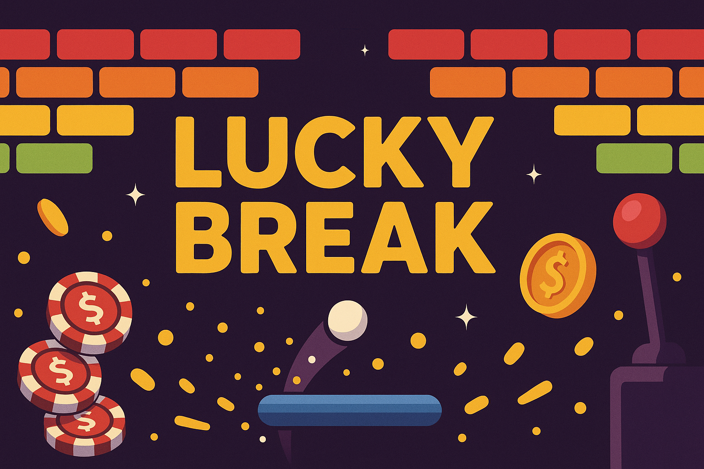

# Lucky Break

[](https://github.com/dlkesterson/lucky-break/actions/workflows/ci.yml)
[](https://dlkesterson.github.io/lucky-break/coverage/index.html)

Lucky Break is a high-tempo brick breaker with deterministic physics, multi-ball chaos, wager-driven bricks, and reactive audio that leans into every rally.

## Play Online

The latest build is published via GitHub Pages: https://dlkesterson.github.io/lucky-break/

## Core Systems

- `Deterministic loop` keeps physics, audio, and replays in lockstep via a fixed timestep, seeded RNG, and saved session snapshots.
- `Multi-ball + rewards` stackable power-ups, gamble bricks, and reward wheels keep the power curve fresh each round.
- `Reactive audio` uses Tone.js transport, MIDI accents, and predictive foreshadowing to telegraph impacts before they land.
- `Responsive input` supports mouse, touch gestures, and gamepads with adaptive paddle smoothing and accessibility toggles.
- `HUD & scenes` run on a Pixi scene stack with combo overlays, mobile layout scaling, and quick transitions between menus, gameplay, and recaps.

## Tech Stack

- TypeScript 5 (strict) compiled with Vite 7 and pnpm workspaces.
- PixiJS 8 for rendering, post-effects, and HUD orchestration.
- Matter.js 0.19 for deterministic physics simulation and collision contracts.
- Tone.js 14 for music direction, MIDI scheduling, and audio foreshadowing.
- Vitest + Playwright for unit, integration, and automation coverage enforced in CI.

## Getting Started

```bash
pnpm install
pnpm dev
```

`pnpm dev` boots the Vite dev server. Open the printed URL in a desktop or mobile browser—the layout adapts on the fly. Plug in a controller or use touch to feel the input tuning.

### Development Commands

- `pnpm build` – Production bundle with cache-busting assets.
- `pnpm lint` – ESLint across `src/` and `tests/` with `--max-warnings=0`.
- `pnpm test` – Vitest unit + integration suites in watchless mode.
- `pnpm test:e2e` – Playwright end-to-end coverage (headless by default).
- `pnpm simulate:verify` – TSX-powered deterministic simulations used in CI.
- `pnpm run cli:simulate` – Headless CLI runner for deterministic gameplay scripts and tuning bots (requires `pnpm build`).

## Project Layout

```
src/
  app/        # Loop, runtime modules, state machines, replays
  audio/      # Music director, MIDI engine, SFX, foreshadowing
  cli/        # Headless engine, tuning bots, automation scripts
  config/     # Gameplay constants, asset registries, themes
  game/       # Rewards, gamble bricks, achievement logic
  input/      # Cross-platform input adapters and launch control
  physics/    # Matter.js world setup, launches, attachments
  render/     # Pixi scenes, HUD, effects, visual factory
  scenes/     # Scene stack entries (menu, gameplay, pause, etc.)
  util/       # Shared helpers (RNG, math, scoring, logs)
```

Tests live under `tests/` split into `unit/`, `integration/`, `e2e/`, and CLI helpers. Coverage reports publish with the game to GitHub Pages at `/coverage/` on every push to `main`.

## Determinism & Replays

- Session state is driven by seeded RNG; replays capture inputs and layout seeds for frame-perfect playback.
- The `game/runtime` facade exposes a diagnostics surface for latency, combo momentum, and foreshadow predictions.
- CLI tooling (`pnpm run cli:simulate` after `pnpm build`, or `pnpm simulate:verify` during development) runs deterministic scenarios for balancing and regression tracking without spinning up Pixi.

## Contributing

We follow conventional TypeScript + Pixi patterns with strict linting and coverage gates. Please include tests when you touch runtime logic, new rewards, or visual/audio systems.
