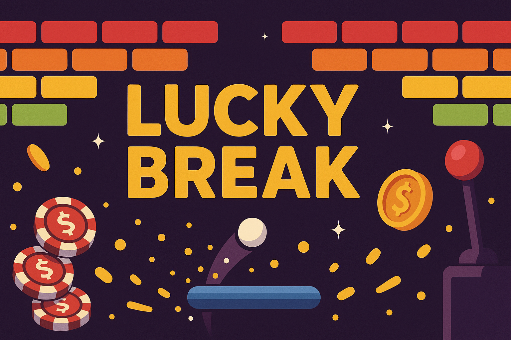

# Lucky Break

[](https://github.com/dlkesterson/lucky-break/actions/workflows/ci.yml)
[](https://dlkesterson.github.io/lucky-break/coverage/index.html)

Lucky Break is a high-tempo brick breaker with deterministic physics, multi-ball chaos, wager-driven bricks, and reactive audio that leans into every rally.

## Play Online

The latest build is published via GitHub Pages: https://dlkesterson.github.io/lucky-break/

## Gameplay Video

<!-- Uncomment and update the path once you've optimized your video with ffmpeg -->
<!-- See docs/video-optimization.md for optimization commands -->

<!--
<video width="100%" controls>
  <source src="docs/gameplay.mp4" type="video/mp4">
  Your browser does not support the video tag.
</video>
-->

## Gameplay Overview

- Lean paddle-and-ball play: aim the paddle, keep volleys alive, and clear wagered bricks before the countdown expires.
- Stackable power-ups: collect drops to widen the paddle, add multi-ball chaos, or trigger score multipliers that reshape the rally.
- Gamble bricks and reward wheel: risk stored entropy for bigger payouts, then spend it mid-run on reroll, shield, or bailout actions.
- Deterministic sessions: seeded layouts, physics, and audio ensure replays and CLI simulations stay frame-perfect across devices.

## Core Systems

- `Deterministic loop` keeps physics, audio, and replays in lockstep via a fixed timestep, seeded RNG, and saved session snapshots.
- `Multi-ball + rewards` stackable power-ups, gamble bricks, and reward wheels keep the power curve fresh each round.
- `Reactive audio` uses Tone.js transport, MIDI accents, and predictive foreshadowing to telegraph impacts before they land.
- `Responsive input` supports mouse, touch gestures, and gamepads with adaptive paddle smoothing and accessibility toggles.
- `HUD & scenes` run on a Pixi scene stack with combo overlays, mobile layout scaling, and quick transitions between menus, gameplay, and recaps.

## Tech Stack

- pnpm 8 workspace with TypeScript 5 (strict) across packages.
- PixiJS 8 for rendering, post-effects, and HUD orchestration.
- Matter.js 0.20 for deterministic physics simulation and collision contracts (shared via `@lucky-break/core-domain`).
- Tone.js 15 for music direction, MIDI scheduling, and audio foreshadowing.
- React 18 + Radix UI primitives via `@lucky-break/design-system` for UI components.
- Storybook 10 for component workbench and visual documentation.
- Vitest + Playwright for unit, integration, and automation coverage enforced in CI.
- Python 3.11 + Gymnasium + Stable Baselines 3 for offline RL agent training via `@lucky-break/ml-trainer`.

## Getting Started

```bash
pnpm install
pnpm dev
```

`pnpm dev` boots the Vite dev server from `@lucky-break/web-client`. Open the printed URL in a desktop or mobile browser—the layout adapts on the fly. Plug in a controller or use touch to feel the input tuning.

## Keyboard Shortcuts

- `Arrow Left` / `KeyA` and `Arrow Right` / `KeyD` – Move the paddle when you prefer keyboard over pointer control.
- `Space` – Launch the attached ball without clicking or tapping.
- `KeyP` or `Escape` – Pause or resume the current run.
- `KeyQ` (while paused) – Quit to the main menu.
- `Shift` + `KeyC` – Toggle the high-contrast theme for better visibility.
- `KeyR`, `KeyS`, `KeyB` – Trigger reroll, shield, and bailout entropy actions (only when the HUD marks them as ready).
- `F2` / `F3` – Show or hide the input and physics debug overlays during development builds.

## Accessibility & Settings

- High-contrast mode: press `Shift` + `C` or toggle from the main menu to swap to the accessibility palette on the fly.
- Input smoothing & aim assists: adaptive paddle smoothing keeps keyboard and touch control responsive; long-press on touch to lock an aim vector before launch.
- Multi-input parity: mouse, touch, keyboard, and gamepad share the same launch manager so replays stay deterministic regardless of device.
- Audio telegraphing: Tone.js scheduler foreshadows key impacts and combo spikes, helping players anticipate hectic volleys.

### Development Commands

- `pnpm build` – Production bundle for `@lucky-break/web-client` with cache-busting assets.
- `pnpm lint` – ESLint across all packages with `--max-warnings=0`.
- `pnpm typecheck` – TypeScript project references across every package.
- `pnpm test` – Vitest unit + integration suites (web client).
- `pnpm test:e2e` – Playwright end-to-end coverage (headless by default).
- `pnpm simulate:verify` – TSX-powered deterministic simulations (CLI) used in CI.
- `pnpm --filter @lucky-break/design-system storybook` – Run Storybook component workbench locally.
- `pnpm --filter @lucky-break/design-system build-storybook` – Build static Storybook bundle.
- `pnpm --filter @lucky-break/cli-sim exec tsx src/index.ts simulate --seed 42` – Run the headless CLI without building.

### Reinforcement Learning Training

The `@lucky-break/ml-trainer` package provides a Python-based RL harness for training agents using Gymnasium and Stable Baselines 3:

```bash
cd packages/ml-trainer
python -m venv .venv
.venv\Scripts\activate
pip install -r requirements-dev.txt

# Train a PPO agent
python train_agent.py --timesteps 1000000 --seed 1337

# Evaluate a trained model
python evaluate_agent.py models/ppo_lucky_break.zip --episodes 5
```

The environment wraps the existing `simulate-rl` CLI, logs frame-level trajectories to `trajectories/`, and supports TensorBoard monitoring. See `packages/ml-trainer/README.md` for details.

## Workspace Layout

```
packages/
  core-domain/   # Shared deterministic loop, physics, config, rewards, utilities
  design-system/ # Shared React UI components, Tailwind tokens, Storybook documentation
  cli-sim/       # Headless engine + deterministic regression tooling (TS + Tsx scripts)
  ml-trainer/    # Python RL harness for training agents via Gym + Stable Baselines 3
  web-client/    # Pixi front-end, Vite build, assets, Playwright + Vitest suites
scripts/         # Shared CI tooling (e.g., deterministic replay generator)
```

The web client keeps its runtime under `packages/web-client/src`, while shared logic lives in `packages/core-domain/src`. Automation and CLI helpers live in `packages/cli-sim/src` and reuse the same modules through workspace aliases.

Tests live in `packages/web-client/tests/{unit,integration,e2e}` with Vitest setup in `tests/setup`. Coverage reports are emitted to `packages/web-client/coverage` and copied into the built site for GitHub Pages at `/coverage/` on every push to `main`.

## Testing Strategy

- Vitest unit and integration suites (`pnpm test`) validate rendering, audio hooks, and deterministic physics adapters under JSDOM.
- Playwright end-to-end coverage (`pnpm test:e2e`) exercises the browser client with the same Vite aliases used in production builds.
- CLI simulations (`pnpm simulate:verify`) replay seeded sessions headlessly to guarantee physics determinism and entropy flows stay intact.
- Coverage thresholds (80% statements/lines, 75% branches/functions) are enforced in CI; failing thresholds gate merges until addressed.

## Determinism & Replays

- Session state is driven by seeded RNG; replays capture inputs and layout seeds for frame-perfect playback.
- The `game/runtime` facade exposes a diagnostics surface for latency, combo momentum, and foreshadow predictions.
- CLI tooling (`pnpm --filter @lucky-break/cli-sim exec tsx src/index.ts simulate` for ad-hoc runs, or `pnpm simulate:verify` during development/CI) exercises deterministic scenarios for balancing and regression tracking without spinning up Pixi.

## Contributing

We follow conventional TypeScript + Pixi patterns with strict linting and coverage gates. Please include tests when you touch runtime logic, new rewards, or visual/audio systems.
